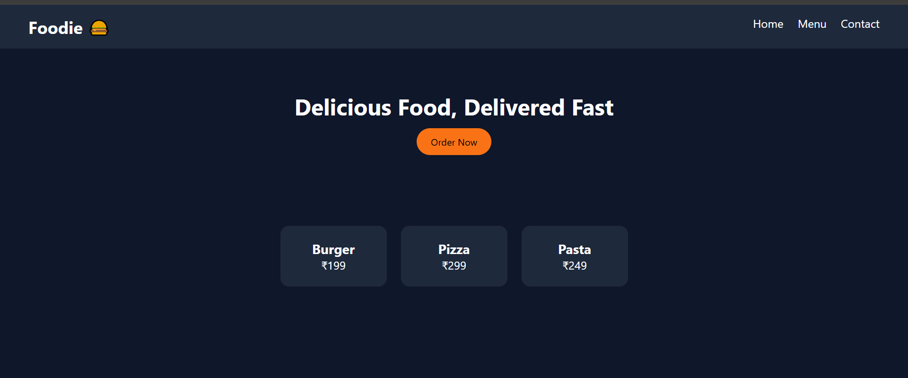

# 🍔 Restaurant Website UI - Day 1 Project 14

## 📌 Project Overview

This project is a modern **Restaurant Website UI** created as part of my semester challenge to build 200 websites.

It represents a simple restaurant homepage with a navigation bar, hero section, and menu items.

---

## 🎯 Features

* 🍔 Navigation Bar
* 🏠 Hero Section with Call-to-Action
* 📋 Menu Cards (Food Items & Prices)
* 🎨 Clean and Modern UI
* 📱 Responsive Layout

---

## 🛠️ Technologies Used

* HTML5
* CSS3 (Flexbox)

---

## 📂 Project Structure

```id="cznxb6"
site-14-restaurant-website/
│
├── index.html
├── style.css
├── preview.png
└── README.md
```

---

## 📸 Preview



---

## 💡 Learning Outcome

* Learned website layout structure
* Practiced Flexbox layout
* Built real-world UI design
* Improved UI/UX skills
* Strengthened Git & GitHub workflow

---

## 🔥 Author

**Yash Patil**
Future Data Engineer 🚀

---

## ⭐ Note

This project is part of my goal to build **200 websites** to improve my web development and design skills.
